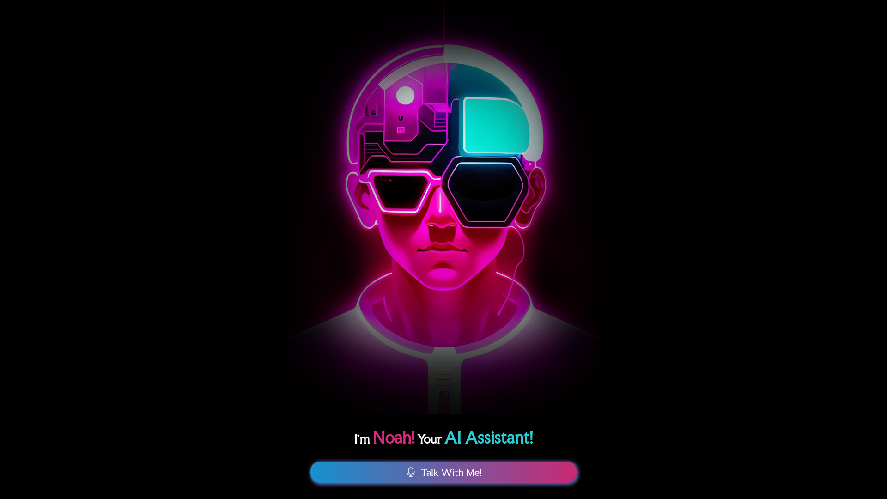
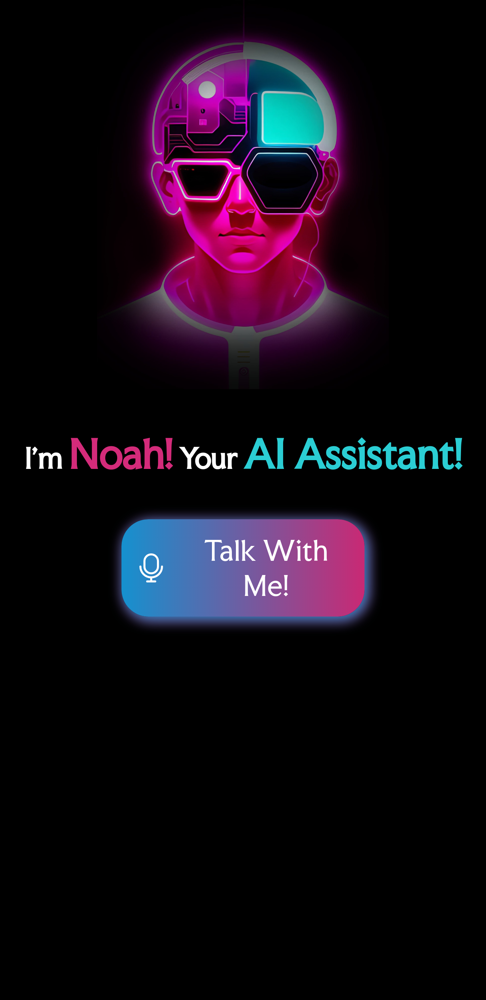

  
  
  
  

   
   

  <h2 align="center">Noah AI 👾</h2>

  _🥀 Noah is an Artificial Intelligence made using JavaScript And HTML, CSS for making a beautiful UI✨._

  <a href="https://nevilxd.github.io/NoahAI"><strong>➥ Live Demo 🖤</strong></a>

 

### Demo Screenshots 🌟

### Contact 📞

_If you want to contact with me you can reach me at [**Telegram**](https://t.me/TheHamkerGuy)._

### License 💜

_This project is licensed under the [**MIT LICENSE**](https://github.com/NevilXD/NoahAI/blob/4ddd72b191dc96dda649c7a71de642aa0b96af84/LICENSE#L5). See the LICENSE file for more._
